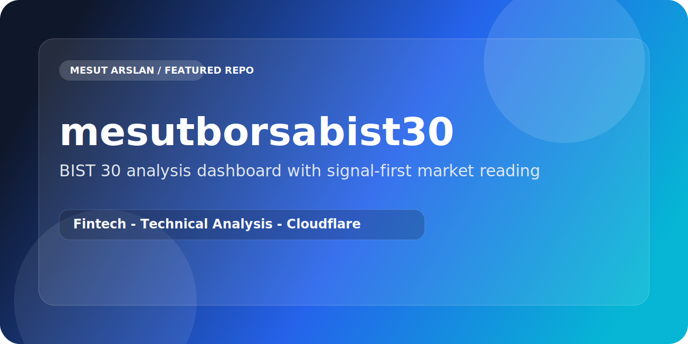

  

  
  
  

# mesutborsabist30

`mesutborsabist30` is a BIST 30 focused analysis product built to make signals, summaries, and market structure easier to scan at a glance.

## Why It Stands Out

- Organizes market data around action, not raw clutter
- Surfaces technical context in a more readable dashboard form
- Keeps BIST 30 as the clear center of the product
- Mixes frontend presentation with supporting automation logic

## Project Structure

- `site/` for the user-facing dashboard
- `functions/` for backend or serverless support
- `python/` for analysis and data-related logic

## Stack

- JavaScript
- HTML
- CSS
- Python
- Cloudflare

## Product Direction

The product goal is not simply to show stock data. It aims to compress decision context into a faster visual workflow for monitoring, scanning, and prioritizing attention.
